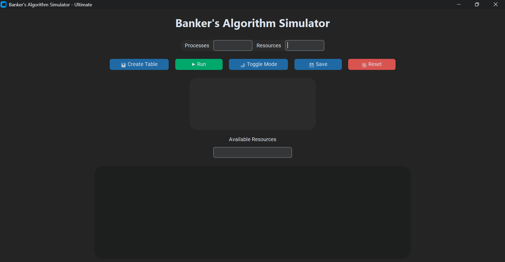
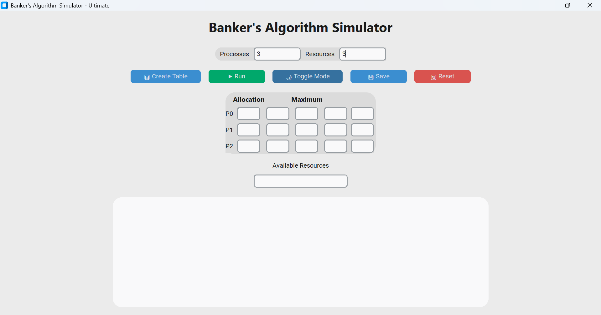

# Banker Algorithm Simulator

## 📌 Project Overview

The Banker Algorithm Simulator is a desktop-based application developed in Python. It demonstrates the concept of **Deadlock Avoidance** in Operating Systems using the Banker’s Algorithm. This project helps students understand how system resources are allocated safely to avoid deadlocks.

---

## 🚀 Features

* Implementation of Banker’s Algorithm
* Safe state detection
* Resource allocation simulation
* User-friendly interface
* Step-by-step process visualization

---

## 🛠️ Technologies Used

* Python 3.x
* Tkinter (for GUI)
* PyInstaller (for EXE build)

---

## 📸 Screenshots

Add your screenshots inside a folder named `screenshots/` and use below format:

```


```

---

## 📦 How to Run Project

### ▶️ Method 1: Python File

1. Install Python
2. Run command:

```
python main.py
```

### ▶️ Method 2: EXE File

1. Go to `dist/` folder
2. Double click `main.exe`

---

## 📥 How to Build EXE

If you want to generate EXE yourself:

```
pip install pyinstaller
pyinstaller --onefile --windowed main.py
```

EXE will be created in `dist/` folder.

---

## 📂 Project Structure

```
Banker_Project/
│
├── main.py
├── dist/
│   └── main.exe
├── screenshots/
├── README.md
```

---

## 👨‍💻 Developer

* Name: SirajIbrar-dev
* Email: [sirajmughal375@gmail.com](mailto:sirajmughal375@gmail.com)

---

## ⭐ Future Improvements

* Web version of simulator
* Enhanced UI design
* Step animation of algorithm

---

## 📢 Note

This project is for educational purposes to understand Operating System concepts.
